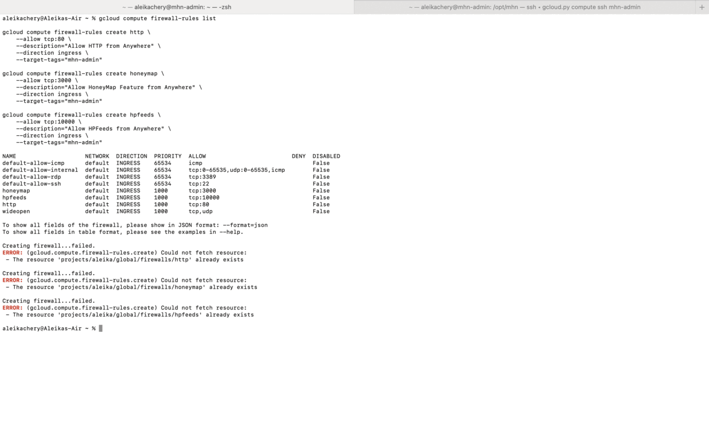
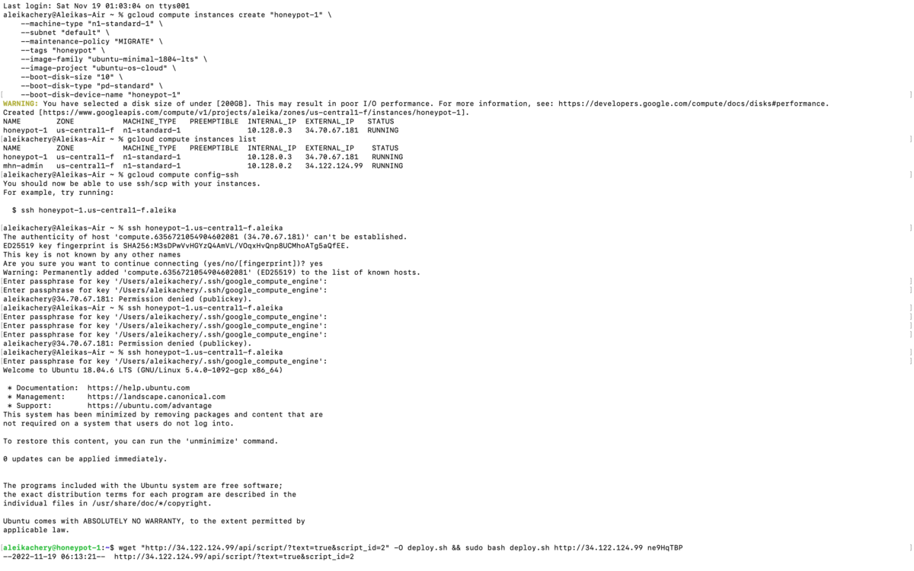

# Honeypot Assignment

**Time spent:** **12** hours spent in total

**Objective:** Create a honeynet using MHN-Admin. Present your findings as if you were requested to give a brief report of the current state of Internet security. Assume that your audience is a current employer who is questioning why the company should allocate anymore resources to the IT security team.

### MHN-Admin Deployment (Required)

**Summary:** How did you deploy it? Did you use GCP, AWS, Azure, Vagrant, VirtualBox, etc.?
I deployed MHN-ADMIN using GCP. First, I updated and installed the python packages and installed MHN while using MHN Admin VM. Next, I created a MHN Honeypot VM using GCP. Then, I established an SSH connection to the Honeypot VM. I did this by creating the firewall rules to allow incoming TCP and UDP and installed the Honeypot VM. In my gif I took screenshots after I had already completed all the steps. Therefore, the error message says that the applications I'm attempting to  create/download already exist. I did everything correctly please don't remove points because I took screenshots after I finished.

### Dionaea Honeypot Deployment (Required)

**Summary:** Briefly in your own words, what does dionaea do?
Dionaea is a honeypot that mimics certain online services to attract attackers to it. When attackers attempt to bypass the firewall by inputting malware, dionaea makes a copy of the malware.

### Database Backup (Required) 

**Summary:** What is the RDBMS that MHN-Admin uses? What information does the exported JSON file record?
MHN-Admin 
The exported JSON file contains the list of the malware that robots have used to infiltrate the firewall.

*Be sure to upload session.json directly to this GitHub repo/branch in order to get full credit.*

## Notes

Describe any challenges encountered while doing the assignment.

I had to restart my project because I wasn't receiving any attacks after creating my honeypot. I was able to see numerous attacks on the map, but none of them were directed towards my honeypot. After restarting I followed along with the installment video provided in class and I was able to receive attacks.
