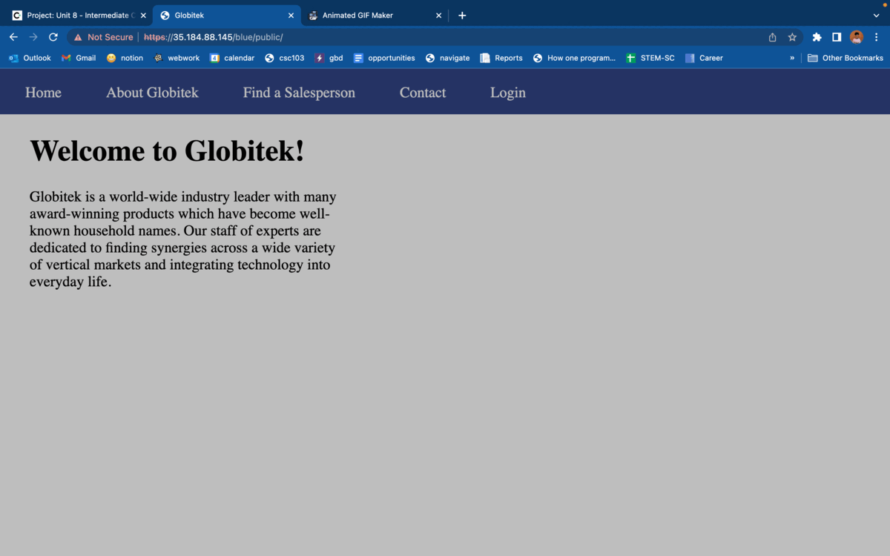
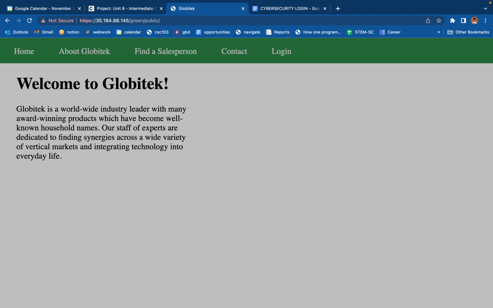
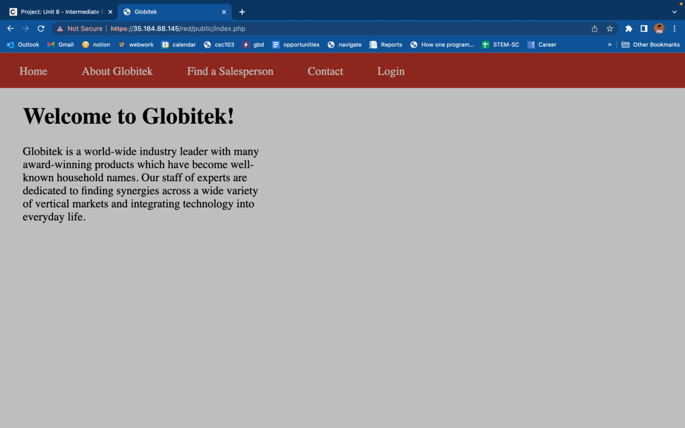

# Pen Testing Live Targets

Time spent: **5** hours spent in total

> Objective: Identify vulnerabilities in three different versions of the Globitek website: blue, green, and red.

The six possible exploits are:

* Username Enumeration
* Insecure Direct Object Reference (IDOR)
* SQL Injection (SQLi)
* Cross-Site Scripting (XSS)
* Cross-Site Request Forgery (CSRF)
* Session Hijacking/Fixation

Each color is vulnerable to only 2 of the 6 possible exploits. First discover which color has the specific vulnerability, then write a short description of how to exploit it, and finally demonstrate it using screenshots compiled into a GIF.

## Blue

Vulnerability #1: SQL Injection

Description: To exploit using SQL Injection, click on "find a salesperson" and pick any person on the list. Then, replace the id number of the user found in the url with a SQL code that always returns true. The message when you submit this url request will say "database query failed."

## Green

Vulnerability #1: Username Enumeration and Cross-Site Scripting

Description: I found two vulnerablities in the green version of the website and depicted them in the green gif.

To perform Username Enumeration, you must first attempt to log into the site using an existing username with an incorrect password. The website will return the message "log in was unsuccessful" in print. Next, attempt to log in using a nonexisting username and any password. The website will return the same message a before, but it will be in bold. To perform the Cross-Site Scripting exploit, you must go to the feedback page without logging in. Fill out the form by inputting any name, email address, and a javascript code message into the "feedback" area. Next, log into the website and click on "feedback." The javascript code will run once you click on that page. 

## Red

Vulnerability #1: Insecure Direct Object Reference

Description: To exploit using Insecure Direct Object Reference, you must click on "find a salesperson" and pick any person on the list. Then, replace the id number of the user found in the url with other numbers until you see pages that shouldn't be available to the public because it contains sensitive information. Another way to do this is by using Burp Suite and sending the request to intruder. Add a payload to the id number and start the attack. You will be able to see how many pages exist with salesperson information and their contents.

## Notes

It was a challenge performing the cross site scripting because I wasn't sure which website (red, blue, green) had the vulnerability and which part of the website was vulnerable to cross site scripting. I tried using javascript code on different pages such as the "Add a saleperson" page after logging in and I the different parts of the feedback form when logged out. I was able to succeed when I injected javascript code into the feedback input of the feedback form.

